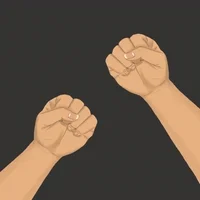
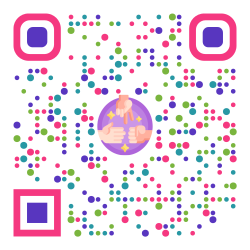

# Rock ✊ Paper 🖐️ Scissors ✌️



Multiplayer Rock Paper Scissors Game using Computer Vision and WebRTC.

<!--toc:start-->

- [Rock ✊ Paper 🖐️ Scissors ✌️](#rock--paper-️-scissors-️)
  - [Play the Game](#play-the-game)
  - [Model Training](#model-training)
    - [Requirements](#requirements)
    - [Steps](#steps)

## Play the Game



1. Visit [rps-21b02a.gitlab.io](https://rps-21b02a.gitlab.io) to play
2. Click `Share` & Share the copied `URL` with your friends
3. The other Player must visit the `URL` you Shared and click `Join`
4. You can start Playing by showing rock-paper-scissors on the Camera.

## Model Training

### Requirements

1. Python Version: 3.9
2. mediapipe-model-maker

```sh
pip install mediapipe-model-maker
```

3. rock paper scissors dataset

```sh
wget https://storage.googleapis.com/mediapipe-tasks/gesture_recognizer/rps_data_sample.zip
unzip rps_data_sample.zip
```

### Steps

1. Train the model locally

```sh
python train.py
```

2. Copy the trained model to the `public/` directory

```sh
cp exported_model/gesture_recognizer.task public/
```

3. Test the model on the browser

```sh
yarn && yarn dev
```

Open `http://localhost:5173`.
